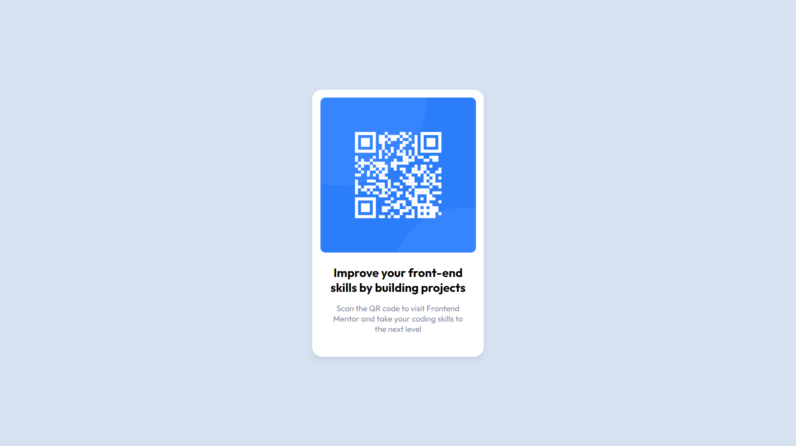

# Frontend Mentor - QR code component solution

This is a solution to the [QR code component challenge on Frontend Mentor](https://www.frontendmentor.io/challenges/qr-code-component-iux_sIO_H). Frontend Mentor challenges help you improve your coding skills by building realistic projects. 

## Table of contents

- [Overview](#overview)
  - [Screenshot](#screenshot)
  - [Links](#links)
- [Author](#author)

**Note: Delete this note and update the table of contents based on what sections you keep.**

## Overview

### Screenshot

### Links

- [Solution URL](https://github.com/choudhary-akash/frontend-mentor/tree/main/1.%20qr-code-component-main)
- [Live Site URL](https://choudhary-akash.github.io/frontend-mentor/1.%20qr-code-component-main/index.html)

## Author

- Github - [choudhary-akash](https://github.com/choudhary-akash)
- Frontend Mentor - [@choudhary-akash](https://www.frontendmentor.io/profile/choudhary-akash)
- Twitter - [@akashc0](https://www.twitter.com/akashc0)

